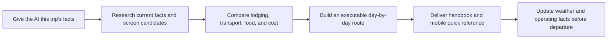

# AI Travel Planning Kit (AI 旅行规划工具包)

## Let AI research, choose accommodation, build routes, control costs, and deliver a trip plan you can actually follow

[中文主页](README.md) · [Complete usage guide](docs/usage-guide.en.md) · [Agent setup](docs/agent-platforms.en.md) · [Edit preferences with AI](docs/ai-review-guide.en.md) · [Prompt library](examples/prompts.en.md)


**AI Travel Planning Kit** is an open-source set of working instructions and templates for AI agents. Tell the AI where you are going, when, with whom, your approximate budget, and what cannot be compromised. The Kit then tells the AI how to:

- research and verify current destination information;
- distinguish places with real travel value from strong marketing;
- compare accommodation areas and exact properties;
- combine attractions, meals, transport, rest, and lodging into a route that works;
- prepare for payments, connectivity, exchange, fees, tips, scams, and language friction;
- add museum, photography, self-drive, hiking, and international modules only when relevant;
- deliver a complete handbook, mobile quick reference, image directions, and pre-departure update list.

It is not a booking app or a fixed itinerary. It is a reusable specification for travel-planning work: what an AI must investigate, how it should compare options, which facts must be checked for this trip, and how the result should be organised for use on the road.

You can add, remove, or edit personal preferences. Destination, dates, travelers, budget, and travel mode are collected again for every trip instead of being hard-coded as a permanent profile.

## Chinese and English editions

The repository includes two complete, independently installable Skills. They implement the same planning behavior, but you normally enable only the language you use so the AI does not load both text sets into context.

| Language | Skill invocation | Release package | Portable single file |
|---|---|---|---|
| 中文 | `$plan-reliable-trips` | `plan-reliable-trips-skill.zip` | `ai-travel-planning-kit-portable.md` |
| English | `$plan-reliable-trips-en` | `plan-reliable-trips-en-skill.zip` | `ai-travel-planning-kit-portable.en.md` |

The English edition includes its own setup guide, usage guide, preference-review method, prompt library, trip brief, all specialist planning rules, and delivery contract. It is not merely a translated homepage.

## What it helps you do



For example:

> Two of us will spend seven days in Japan's Kansai region in October, flying round-trip from Shanghai with a budget of about CNY 20,000. It is our first visit. We want both major sights and genuinely worthwhile lesser-known experiences, and we will not drive. First decide where we should stay and how to divide the cities and nights, then build the complete route.

The Kit tells the AI to confirm only the conditions that truly change the plan, then research accommodation areas, intercity transport, attraction value, food, payment, and reservations before assembling one connected plan. It should not immediately produce an impressive-looking list of attractions.

## Core capabilities and practical benefits

| Capability | What it solves in practice |
|---|---|
| Destination and attraction screening | Finds major and lesser-known experiences, evaluates real travel value, and challenges score manipulation, viral marketing, and high-attention/low-value places |
| Executable itinerary | Includes door-to-door movement, queues, meals, rest, luggage, reservations, buffers, and safe return instead of merely ordering attractions |
| Accommodation as a core decision | Selects the right area first, then compares exact properties by true total price, transport, evening walkability, nearby food, noise, and experiential value |
| Local food in the route | Looks beyond viral lists for local everyday choices and places strong restaurants, small shops, stalls, or markets into each day |
| Budget and hidden costs | Normalises currencies and price units, separates required and optional spending, and exposes taxes, deposits, service charges, and frequently missed costs |
| Transport, payment, and connectivity | Verifies fare systems, mobile wallets, physical cards, cash, exchange, local wallets, SIM/eSIM, roaming, and independent failure fallbacks |
| Taxi, charter, and scam prevention | Gives segment-specific normal price ranges, legitimate channels, written confirmation phrases, and warnings about price switching, currency tricks, or luggage pressure |
| International travel | Covers entry and transit, official charges, service fees, tipping customs, unusual local conditions, local-language signs, and a compact operating/safety card |
| Museums and interpretation | Assesses the real current value of large and small museums, displayed collections, preferred-language support, guide value, and a usable internal route |
| Phone-first photography | Gives public position, direction, composition, people placement, light, and real reference images; expensive or disruptive shots remain optional upgrades |
| Hiking and outdoor readiness | Reviews a user-supplied track and focuses on permits, weather, insurance, medical access, communication, huts, water, equipment, exits, and rescue |
| Clear final delivery | Derives editable Markdown, searchable PDF, a phone quick-reference card, essential images, and an optional print emergency version from one source of truth |

## Why it is more than one long prompt

- **Reusable:** install once, then provide a new destination and current conditions for each trip.
- **Conditional:** city, holiday, international, road-trip, museum, and hiking rules combine freely rather than following one fixed sequence.
- **Integrated:** lodging is not an appendix, food is not a detached list, and transport is not a one-line instruction. They shape route and budget together.
- **Current:** prices, opening, schedules, weather, visas, roads, trails, payment support, and inventory must be checked for the actual trip.
- **Auditable:** missing facts, source conflicts, estimates, and pre-departure rechecks remain visible.
- **Usable in the field:** delivery can include daily quick reference, entrances and transfer images, local names, addresses, phrases, and emergency information.
- **Customisable without becoming rigid:** stable principles, defaults, soft preferences, and one-trip parameters remain separate.

## Start in three steps

### Step 1: install or import

The repository follows a standard `SKILL.md` structure and also supports file upload when an AI product does not support native Agent Skills.

| AI / Agent | Recommended method |
|---|---|
| OpenAI Codex | Link to `~/.codex/skills/plan-reliable-trips-en`, then invoke `$plan-reliable-trips-en` |
| TRAE | Import the GitHub Skill in SOLO, or place it under `.trae/skills/plan-reliable-trips-en` |
| WorkBuddy | Download the English Skill ZIP from Releases and use Add Skill → Upload Skill |
| Claude Code | Put it under `~/.claude/skills/plan-reliable-trips-en` or project `.claude/skills/` |
| Cursor | Use project `.cursor/skills/` / `.agents/skills/`, a personal directory, or GitHub import |
| Windsurf | Use workspace `.windsurf/skills/` or the global Skills directory |
| GitHub Copilot | Use repository `.github/skills/` / `.agents/skills/` or a supported personal Skills directory |
| Gemini CLI | Link the English directory with `gemini skills link` |
| Other file-capable AI | Upload the English core rules and only the specialist modules relevant to this trip |

See [Setup and use in different AI agents](docs/agent-platforms.en.md) for current paths, UI steps, invocation examples, limitations, verification dates, and official product documentation.

If the product accepts documents but not Skills, download `ai-travel-planning-kit-portable.en.md` from the [latest Release](https://github.com/Lukala23/ai-travel-planning-kit/releases/latest) and upload that one file. It is generated from the modular English rules; long-term edits should still be made in the source files.

Codex quick install:

```bash
git clone https://github.com/Lukala23/ai-travel-planning-kit.git
cd ai-travel-planning-kit
mkdir -p ~/.codex/skills
ln -s "$PWD/skill/plan-reliable-trips-en" ~/.codex/skills/plan-reliable-trips-en
```

### Step 2: tell the AI about this trip

You do not have to complete a long fixed questionnaire. Usually start with:

- destination and geographic boundary;
- complete dates and usable time;
- travelers and important mobility, dietary, or other constraints;
- start, finish, and confirmed bookings;
- approximate budget or cost sensitivity;
- the experiences that matter most this time.

Write `Unknown` for anything undecided. See the [English trip brief](skill/plan-reliable-trips-en/assets/trip-brief-template.md) for the full optional structure.

Cross-platform first request:

```text
Use AI Travel Planning Kit for this trip.

Destination: ...
Dates: ...
Travelers: ...
Budget: ...
Confirmed bookings: ...
Most important experiences: ...
Other constraints: ...

First organise this into a per-trip brief. Ask only questions that materially
change safety, feasibility, accommodation area, transport structure, total
budget, or the core experience. Show candidate research and key trade-offs
before producing a seemingly complete hour-by-hour itinerary.
```

### Step 3: confirm key choices, then request formal delivery

First agree on:

1. the truly valuable core places and the marketing-heavy exclusions;
2. the accommodation area and whether an experiential stay justifies a move;
3. city/night allocation and main transport structure;
4. reservations, payments, entry rules, weather, or safety conditions that can change the route;
5. what the current budget should retain, downgrade, or remove.

Then ask:

```text
The key choices are confirmed. Produce the complete travel plan and execution
plan. Integrate accommodation, daily routes, transport, food, budget,
reservations, payments, photography, risks, and alternatives into one plan,
and generate a phone-friendly quick-reference view. Mark the verification date
for every dynamic fact and when it must be checked again.
```

## What formal delivery can contain

When a complete package is useful, the AI derives it from one authoritative source:

| File | When to use it |
|---|---|
| `00_START-HERE.md` | Check package version, latest verification date, file map, and update method |
| `01_TRIP-QUICK-REFERENCE.pdf` | On the road: daily timeline, address, entrance, payment, return, and emergency facts |
| `02_COMPLETE-TRAVEL-HANDBOOK.md` | Continue editing, version-control the plan, or give another AI complete context |
| `02_COMPLETE-TRAVEL-HANDBOOK.pdf` | Mobile search, offline reading, sharing, or single-file AI question answering |
| `media/` | Real photo references, difficult entrances, transfer locators, and essential diagrams |
| `03_PRINT-EMERGENCY.pdf` | Optional backup for international, remote, hiking, or unreliable-connectivity travel |

A short, simple trip should not generate every file mechanically. Delivery is conditional on actual use.

## How the Kit improves information reliability

It requires the AI to:

- research current price, opening, reservation, timetable, visa, weather, road, trail, payment, and inventory facts for this trip;
- use at least two independent sources for safety, law, and expensive non-refundable decisions, including the authority or direct operator;
- use official sources for rules and operation, and recent visitor evidence for queues, wayfinding, and field problems;
- use social platforms for candidate discovery rather than treating likes, rank, or score as proof of value;
- label conclusions as `Verified / Recheck before departure / Conditional / Uncertain / Planning judgment`;
- preserve source conflicts and never invent price, coordinate, timetable, ticket, track data, or alleged official advice.

Every AI can be wrong. The Kit improves completeness, transparency, and auditability; it cannot guarantee that all dynamic facts are correct. A human still needs to confirm important bookings, high-risk activities, and last-minute conditions.

## Add or change your preferences

You can discuss one topic at a time with an AI. Ask it to classify each proposal before changing files:

| Type | Example | Treatment |
|---|---|---|
| Safety/legal boundary | Do not use a closed trail; do not recommend payment to a public official | Stable, highest priority |
| Stable hard constraint | Wheelchair access or an explicit inability to drive | Retained until the user changes it |
| Default preference | Ordinary sightseeing uses a normal, sustainable tourist pace | Applied when the current trip does not override it |
| Soft preference | Prefer interesting, portable, locally distinctive small gifts | Ranking bonus, never a gate |
| Per-trip parameter | This destination, traveler count, budget, or holiday intent | Stored only in the current brief and supplied again next trip |

Suggested prompt:

```text
Review only the [accommodation / photography / dining / transport / other]
rules. First explain how the current rule changes a real itinerary, then classify
my comment as a stable rule, default, soft preference, or per-trip parameter.
Do not expand a casual preference into a rigid requirement. Propose simplified
replacement text and wait for my confirmation before editing files.
```

See [Review and edit travel preferences with AI](docs/ai-review-guide.en.md) and the [section-by-section constraint review](docs/constraint-review.en.md).

## Recommended planning rhythm

- **At the start:** confirm destination boundary, days, budget, accommodation area, and transport structure.
- **Before booking:** verify entry/permit rules, high-demand reservations, performances, intercity transport, exact hotel room rights, and cancellation.
- **About T-7 days:** update weather, temporary closure, construction, galleries, trails, restaurants, and major route status.
- **About T-48 hours:** recheck warnings, flights/trains/ferries, entrances, meeting points, payment, and connectivity fallback.
- **During the trip:** update only the affected future portion while protecting hard reservations, safe return, and accommodation connections.

Select checkpoints by actual risk; not every trip needs every step.

## Repository structure

```text
ai-travel-planning-kit/
├── README.md                         # 中文主页
├── README.en.md                      # English homepage
├── docs/
│   ├── agent-platforms.md / .en.md
│   ├── usage-guide.md / .en.md
│   ├── ai-review-guide.md / .en.md
│   └── constraint-review.md / .en.md
├── examples/
│   └── prompts.md / prompts.en.md
├── scripts/
│   └── build-release-assets.sh
└── skill/
    ├── plan-reliable-trips/          # Complete Chinese Skill
    └── plan-reliable-trips-en/       # Complete English Skill
```

English entry points:

- [Skill entrypoint](skill/plan-reliable-trips-en/SKILL.md)
- [Trip brief template](skill/plan-reliable-trips-en/assets/trip-brief-template.md)
- [Stable planning principles](skill/plan-reliable-trips-en/references/planning-principles.md)
- [Source-verification rules](skill/plan-reliable-trips-en/references/source-verification.md)
- [Formal delivery-package rules](skill/plan-reliable-trips-en/references/deliverable-package.md)
- [Complete constraint-review record](docs/constraint-review.en.md)
- [Copyable prompt library](examples/prompts.en.md)

## Responsible use and privacy

- This project supports travel research and decisions. It does not replace authorities, embassies, operators, clinicians, insurers, licensed guides, or on-site rescue.
- Dynamic facts change, and installing the rules does not give a model live data when that model cannot browse.
- Hiking-track review, weather judgment, and safety advice are not safety certification.
- Never publish passport/identity numbers, full payment details, passwords, verification codes, unredacted booking QR codes, private home addresses, or an unredacted personal itinerary.
- Travelers remain responsible for final decisions based on health, ability, equipment, local law, and actual field conditions.

## Contributing and license

Issues and pull requests are welcome, especially reproducible field failures, country-specific verification methods, better source hierarchies, platform compatibility updates, and simplifications that improve real decisions.

Read the [English contribution guide](CONTRIBUTING.en.md) or [中文贡献指南](CONTRIBUTING.md) before submitting, and remove private booking, identity, payment, and contact information.

[MIT License](LICENSE)

---

If you want AI to produce more than an article that merely resembles a travel guide—if you want a plan that can be checked, edited, updated, and used in the field—Star or Fork the repository and adapt the rules to your own travel style.
